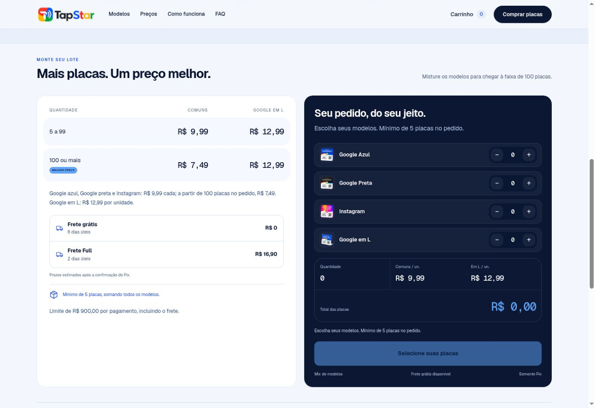

# Verificação TapStar — 04/10/2026

O cliente escolhe as placas e a entrega, revisa o total, preenche o checkout e solicita um Pix. A API recalcula o pedido, cria a cobrança na Mangofy e o site exibe o QR e consulta a confirmação.

Código da correção verificado: `033d7e4a428df6aa7a4581118db5776ce9c242c3`. Publicação Vercel `dpl_nQGg661uHw8wJpQug6DStxNoxXWS`, estado `READY`. Arquivos do navegador em `/static/339be6241281450d/`.

## Resultados e alcance

| Verificação | Resultado | Evidência |
| --- | --- | --- |
| Testes automatizados | 27 aprovados, 0 falhas | `npm test`, Node 24.19.0 |
| Build | Aprovado | `npm run build`, release `339be6241281450d` |
| API em Produção | 20 verificações aprovadas | Requisições reais ao site, sem criar cobrança |
| Páginas e arquivos públicos | 21 respostas HTTP 200 | 6 páginas, 11 assets e 4 arquivos da release |
| Configuração pública | Pronta | `/api/config`: HTTP 200, `ready:true`, `payment_method:pix` |
| Seleção e carrinho no navegador | Aprovado | Quantidades, desconto, modelo em L, CEP e fretes conferidos |
| Sincronização entre abas | Corrigida e confirmada em Produção | 6 placas com Full: R$ 59,94 + R$ 16,90 = R$ 76,84, nas duas abas |
| Formulário vazio | Bloqueado pelo navegador | Primeiro campo obrigatório recebeu foco; nenhum Pix foi criado |
| QR, copia e cola e confirmação | Aprovados em simulação | Cliente e handlers reais com resposta de provedor interceptada, sem rede externa |
| Erros de console do site na sessão | Nenhum observado | Erros da extensão do navegador foram excluídos da análise |
| Credenciais aceitas pela Mangofy real | Não confirmado | Não foi criada cobrança real |
| Pagamento real aprovado | Não executado | Nenhum valor foi pago |

## Falha encontrada e correção

Antes da correção, alterar o carrinho em outra aba mudava o contador do checkout, mas mantinha o resumo antigo: o carrinho mostrava 6 placas/R$ 59,94 e o checkout continuava mostrando 5 placas/R$ 49,95. O payload seria montado a partir do carrinho atualizado.

Agora o checkout acompanha eventos de quantidade e entrega. Também detecta uma alteração que ainda não apareceu na tela no momento do clique e pede revisão do novo total antes de criar o Pix. Campos ficam bloqueados durante a requisição. A preparação retorna `total_cents` e `shipping_cents`; o cliente compara esses valores com o pedido revisado e solicita recarregamento se os preços tiverem mudado.

O comportamento foi confirmado no site publicado, depois de recarregar o checkout: mudar para 5 placas atualizou para R$ 49,95; mudar para 6 placas com Full atualizou quantidade, opção de entrega e total para R$ 76,84.

## Cálculos conferidos

| Pedido | Total | Comportamento |
| --- | --- | --- |
| 4 placas comuns | R$ 39,96 | Finalização bloqueada pelo mínimo de 5 |
| 5 comuns | R$ 49,95 | Permitido |
| 3 comuns + 2 em L | R$ 55,95 | Permitido no simulador |
| 5 em L | R$ 64,95 | Preparação aceita pela API |
| 100 comuns | R$ 749,00 | Desconto de R$ 7,49/unidade |
| 120 comuns, grátis | R$ 898,80 | Permitido |
| 121 comuns, grátis | R$ 906,29 | Bloqueado pelo teto de R$ 900 |
| 117 comuns, Full | R$ 893,23 | Permitido |
| 118 comuns, Full | R$ 900,72 | Bloqueado pelo teto incluindo entrega |
| 120 comuns, Full | R$ 915,70 | Bloqueado no carrinho |

A API recusou CPF, e-mail e telefone inválidos; cartão; origem diferente; ticket falsificado; e alteração de pedido depois da preparação. Valores enviados pelo cliente foram ignorados em favor do recálculo no servidor. Um webhook falso com `approved` foi recusado.

## Testes da tela do Pix

`tests/checkout-dom.test.mjs` cobre imagem do QR, copia e cola, clique duplo, recarregamento de pagamento pendente, consulta de pendente para aprovado, timeout sem repetição automática, CPF inválido recuperável, sincronização entre abas e mudança de preço no servidor.

O QR dessa suíte contém **SIMULACAO TAPSTAR - NAO E UM PIX - NAO PAGAR**. Ele não permite pagamento. As credenciais usadas na suíte são fictícias, os dados de cliente são exemplos de teste e todas as chamadas de rede são interceptadas. Os testes não confirmam que a conta real da Mangofy aceita as credenciais ou a cobrança.

## Verificações ainda necessárias

Para validar a integração externa, gerar uma cobrança usando dados de comprador válidos ou homologação fornecida pela Mangofy. Conferir QR/copia e cola, valor total e semântica do frete no provedor, dados disponíveis para expedição e confirmação após pagamento. Esses passos não foram executados nesta sessão. Não foi usado documento fictício para criar cobrança em Produção.

O CSS contém regras responsivas, mas um celular real não foi testado. A tentativa de abrir o servidor local no navegador remoto foi bloqueada por `ERR_BLOCKED_BY_CLIENT`; os testes do cliente foram executados em DOM isolado e os testes visuais foram feitos no site publicado em desktop. A consulta aos logs de runtime pela conexão Vercel retornou 403; o resultado da API foi verificado diretamente por HTTP.

O lote de 6 placas usado no teste entre abas foi removido. Depois foi preparado, no navegador remoto, um novo lote mínimo de 5 placas comuns, frete grátis e total R$ 49,95, para o usuário preencher os dados válidos e concluir a validação real do Pix. Nenhuma cobrança desse lote foi criada. Nenhuma chave real aparece neste relatório ou nas alterações do repositório.

## Correção após a tentativa real mostrada pelo responsável

O print do responsável mostra resultado incerto no checkout, total R$ 69,85 (5 placas mistas, incluindo uma em L, com frete Full). Esse print não confirma criação ou pagamento. O código anterior descartava a causa de toda exceção da Mangofy e, inclusive quando recebido, descartava o código da cobrança em falhas de conciliação.

A correção adiciona logs e diagnósticos permitidos, preserva referência correspondente devolvida pela Mangofy e permite recuperar cobrança existente somente por GET. Recibos antigos podem usar o código do painel, com conferência de referência, total, método e frete. Não há POST de repetição, banco de pedidos ou exposição de dados pessoais/chaves.

Verificação local: **33 testes passaram**, incluindo autorização HTTP 401, bloqueio HTTP 403 em HTML, validação HTTP 422, serviço HTTP 503, resposta inválida, timeout, falha de conexão, ausência do Pix, valores divergentes, proteção contra vazamento, recibo antigo, cobrança de outro pedido, recuperação do QR e persistência após recarregar. Todas as respostas do provedor nesses testes são simuladas.

A API de logs da Vercel respondeu HTTP 403: a conexão não tem permissão para essa consulta. O diagnóstico antigo não foi registrado pelo código anterior e não pode ser reconstruído deste print. A causa real na Mangofy e a existência da cobrança seguem sem confirmação. Não orientar apagar todos os dados do navegador ou emitir novo Pix antes de conferir o painel.

## Ajustes após o print do Pix copia e cola

O novo print fornecido pelo responsável mostra a tela “Pix gerado”, com código copia e cola e validade, mas sem imagem. Isso confirma a presença do código no navegador, não pagamento aprovado. O frontend anterior só inseria a imagem quando o campo `pix.image` estava disponível; ausência, formato não aceito ou falha de carregamento podiam deixar somente o texto.

O checkout agora gera o QR localmente a partir do mesmo texto já recebido. Não houve geração de cobrança real adicional para testar esta alteração. Interface alterada para azul, todas as menções ao gateway removidas das telas e mensagens públicas, prazo grátis padronizado para 6 dias úteis.

**37 testes passaram**. O leitor independente `jsqr` decodificou o QR gerado e recuperou o texto exato, inclusive em código longo; o DOM confirmou imagem sem `pix_qrcode_image`, persistência ao recarregar, uma única criação simulada e nenhuma consulta adicional ao provedor para obter a imagem.

Publicação confirmada em Produção no commit `98b43926f7869b2598e27d682344d8c7202f458d`, release `40d5adfab818e9bb`, com deploy `READY`. As cinco páginas públicas, configuração e arquivos do checkout/QR responderam HTTP 200. A configuração pública retornou `ready: true`. A inspeção dos textos publicados não encontrou o nome do gateway nem prazo de seis dias sem “úteis”.

O navegador confirmou o tema azul e os dois prazos na página de preços. Captura da versão publicada, sem dados pessoais ou cobrança real:

Uma cobrança já aberta com código copia e cola pode exibir o QR após recarregar o checkout; esta correção não exige gerar outro Pix.
